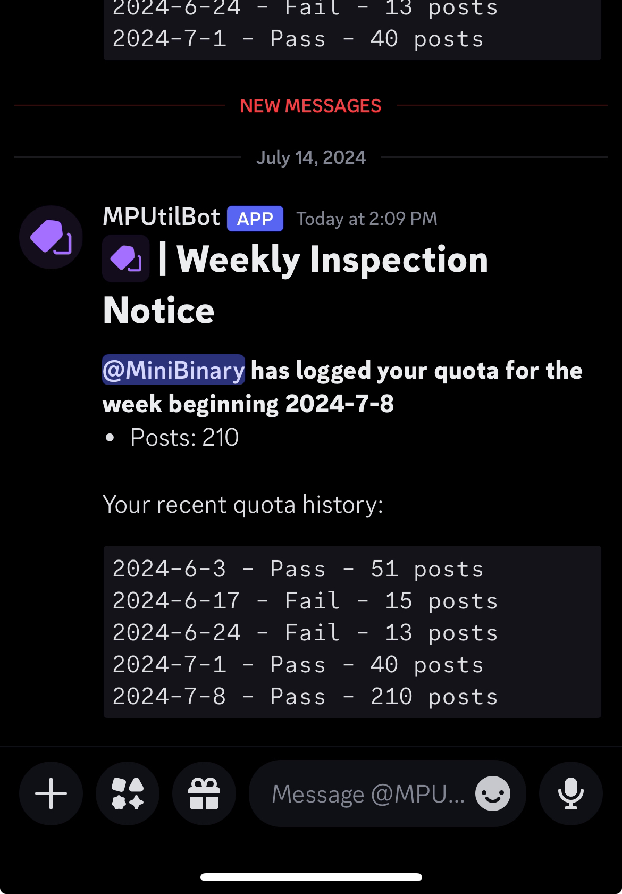
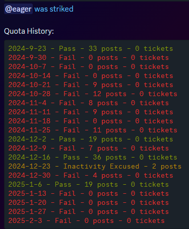
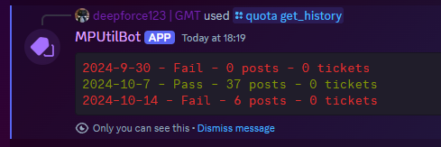

# MPQuotaBot

**Python, discord.py, SQLite, GitHub Actions**

MP is a department within a large commission marketplace for Roblox developers with roughly
40 staff across 180,000+ members, running since 2015.

This bot tracks staff quotas for it. Seniors log how many posts (and tickets) each staff
member did that week, and the bot handles the rest: pass/fail, strikes, rewards,
inactivity notices and MVP.

## What it does

- Logs weekly quotas for staff, seniors and interns (each group has its own requirement)
- Automatically strikes people who miss quota, unless they're excused
- Excuses people who are on an inactivity notice, or who have a reward saved up
- Hands out rewards for consistently hitting quota over the past 4 weeks
- Posts quota/strike logs to the relevant log channels and DMs the user
- Weekly reminders for seniors before and after the inspection period
- MVP list and top performer lookups
- A bunch of misc admin helpers (mass role assigns, CSV exports, nickname prefixes, etc.)

Everything is stored in a local SQLite database (`quotaDB.sqlite`) with tables for
inspections, senior inspections, strikes, rewards, interns and excuses. The tables
are created on startup if they don't exist.

## Screenshots

The DM a staff member gets once a senior logs their week, with their recent history
attached:



The log channel entry when someone misses quota and gets struck:



`/quota get_history`, for checking someone's recent weeks:



## Setup

1. Install the requirements:

   ```
   pip install -r requirements.txt
   ```

2. Make a `.env` file in the project root with your bot token:

   ```
   token=YOUR_BOT_TOKEN_HERE
   ```

3. Run it:

   ```
   python main.py
   ```

The bot needs all intents enabled in the Discord developer portal.

## Deployment

Pushing to `main` triggers `.github/workflows/deploy.yml`, which rsyncs `main.py`,
`requirements.txt` and `commands/` to a VPS over SSH and restarts the `mpquotabot`
pm2 process. There is no build or test stage - it is a deploy-only pipeline.

It needs these repo secrets: `SSH_PRIVATE_KEY`, `SSH_HOST`, `SSH_USERNAME`,
`SSH_DIRECTORY_PATH`.

## Notes

- Guild ID, role IDs and channel IDs are hardcoded near the top of `main.py`. If you're
  running this in a different server you'll need to change them.
- Commands are registered to the one guild, so they show up pretty much instantly.
- `commands/quota.py` and `commands/rewards.py` are loaded as extensions in `setup_hook`.
- The database file is gitignored, so you'll start with an empty one.

## Files

```
main.py             bot setup, tasks, most of the logic and the standalone commands
commands/quota.py   /quota command group
commands/rewards.py reward commands
commands/intern.py  intern register/remove
commands/imports.py shared imports for the cogs
```
